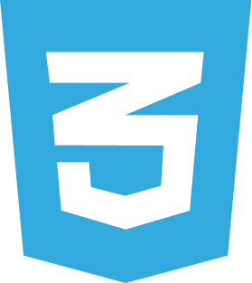
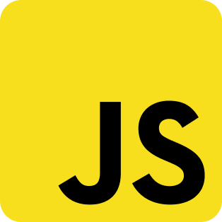
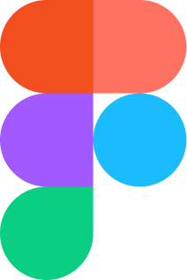
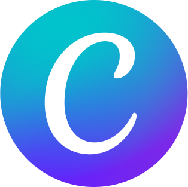

# NataliiaSheludko

## About me ✌️

 Hi there, I'm Nataliia! [hi_there](https://github.com/blackcater/blackcater/raw/main/images/Hi.gif)
I committed to learning and focus on **HTML5, CSS3, JS, React, English**. Passionate about continuously expanding skills in web development. Development and work for the result are important for me

## Education:

- Fullstack developer - IT School GoIT

## Languages:

- English - Pre-intermediate
- Ukrainian - Native

## My Tech Stack Icons:

                      
